# 🎓 Student Portal System (LMS)

A full-stack web-based Student Portal / Learning Management System developed using PHP, MySQL, HTML, CSS, JavaScript, and Bootstrap.

This system provides separate **Admin and Student modules** for managing academic activities, courses, assignments, and learning resources.

---

## 🚀 Features

# 👨‍💼 Admin Panel
- Add, Edit, Delete Students
- Manage Student Details
- Add and Manage Courses
- Upload Course Materials:
  - Video Lectures
  - Lecture Notes
  - Course Information
  - Course Descriptions
- Create and Manage Assignments
- Upload Assignments for Students
- View Student Submitted Assignments
- Send Notifications to Students:
  - Images
  - PDF Files
  - DOCX Files
  - Text Messages
- Automatic Notifications when:
  - New Course is added
  - New Assignment is created

---

# 🎓 Student Panel
- Student Login System
- View Available Courses
- Access Course Materials:
  - Video Lectures
  - Notes
  - Course Information
- View Assignments
- Submit Assignments Online
- View Notifications from Admin
- Personal Workspace:
  - Upload Personal Notes
  - Upload Images
  - Upload Documents (PDF, DOCX, etc.)
  - Manage Personal Study Material

---

## 🛠️ Technologies Used
- PHP (Backend Logic)
- MySQL (Database)
- HTML (Structure)
- CSS (Styling)
- JavaScript (Frontend Logic)
- Bootstrap (Responsive UI)

---

## 🔄 System Workflow

### 🎓 Student Side
- User registers/login
- Dashboard loads student data
- Student enrolls in courses
- Student views assignments and study materials
- Student uploads assignment submissions
- Student receives notifications from admin

---

### 👨‍💼 Admin Side
- Admin logs in to the system
- Admin manages student records (Add / Edit / Delete)
- Admin creates and manages courses
- Admin uploads course materials (notes, videos, documents)
- Admin creates assignments for students
- Admin reviews student submissions

---

## 📊 Project Highlights
- Role-based system (Admin & Student)
- Course & Assignment Management
- File Upload & Download System
- Notification System (PDF, Images, DOCX, Messages)
- Personal Student Workspace
- Fully functional LMS system

---

## 📂 Project Structure

```text
student_portal/
│
├── admin/
│
├── uploads/
│   ├── assignments/
│   ├── submissions/
│   ├── course_materials/
│   ├── course_notes/
│   └── notifications/
│
├── config.php
├── student.sql
├── login.php
├── register.php
├── dashboard.php
├── courses.php
├── assignments.php
├── submit_assignment.php
├── notifications.php
└── edit_profile.php
```

---

## 📸 Screenshots

### Login Page
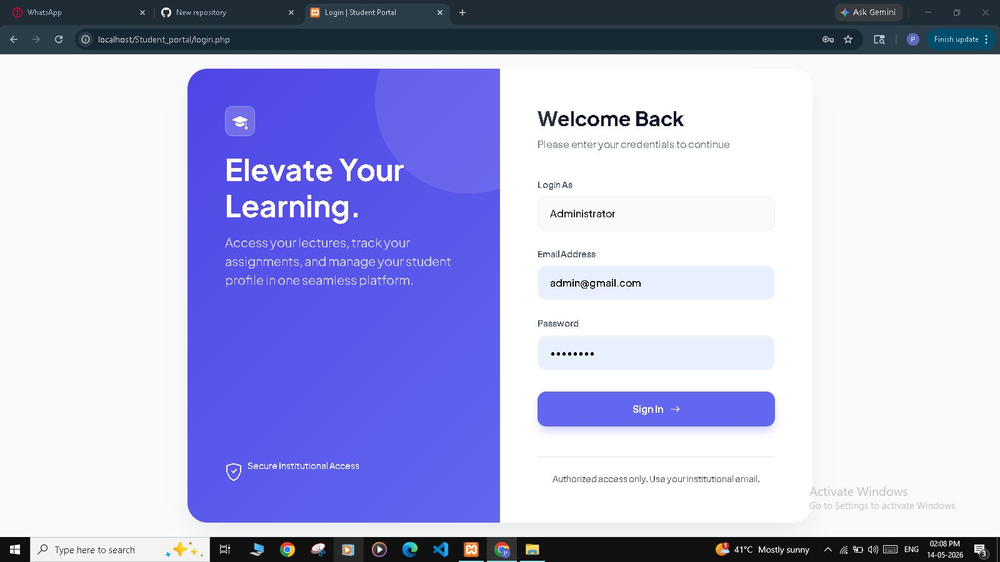

### Admin Dashboard
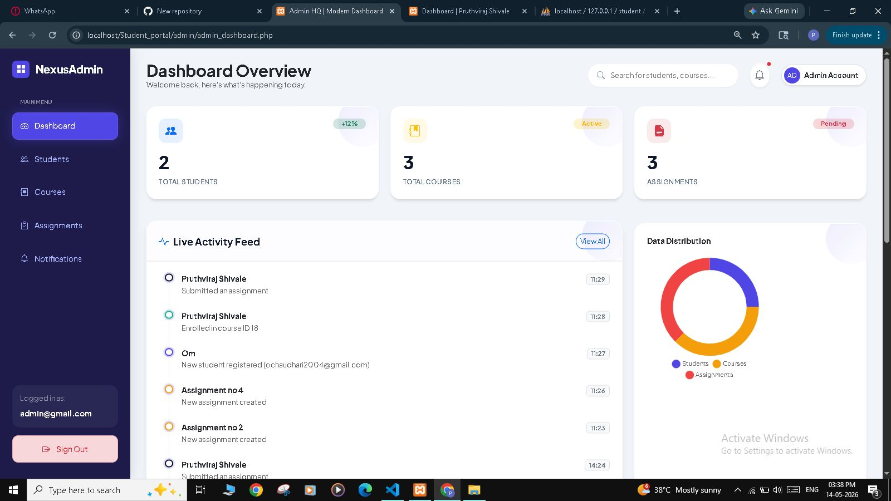

### Student Dashboard
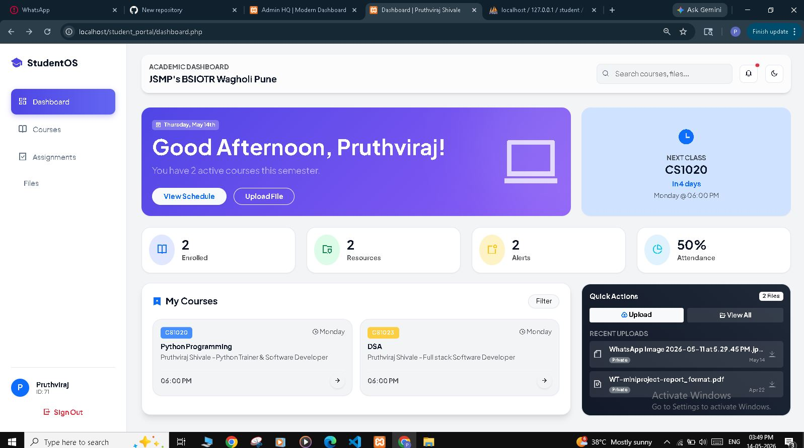

### Student Management
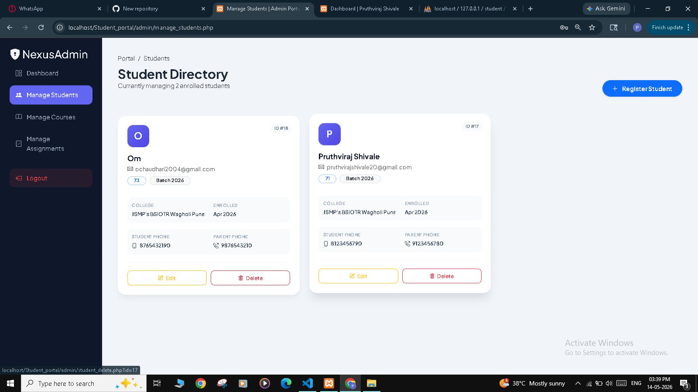

### Course Management
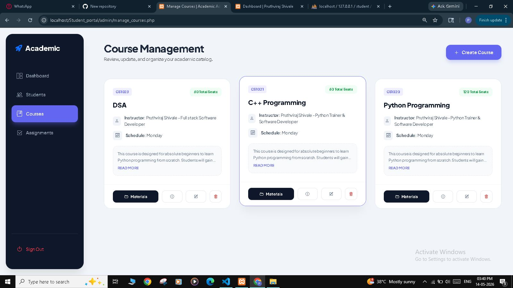

### Course Materials
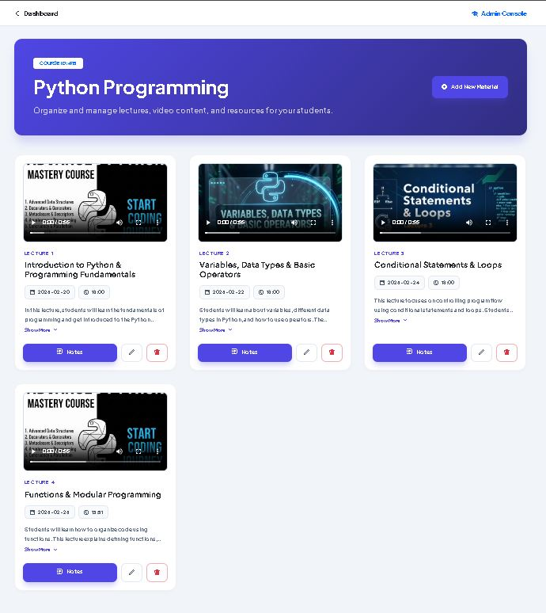

### Upload Notes Page
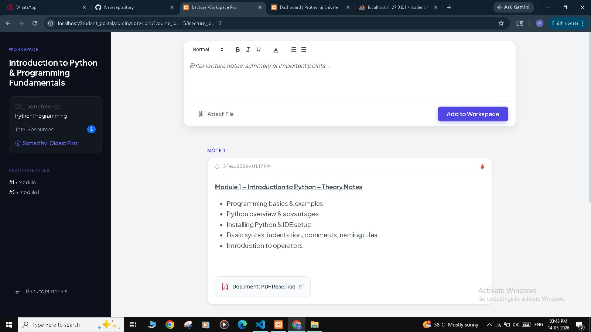

### Manage Assignments
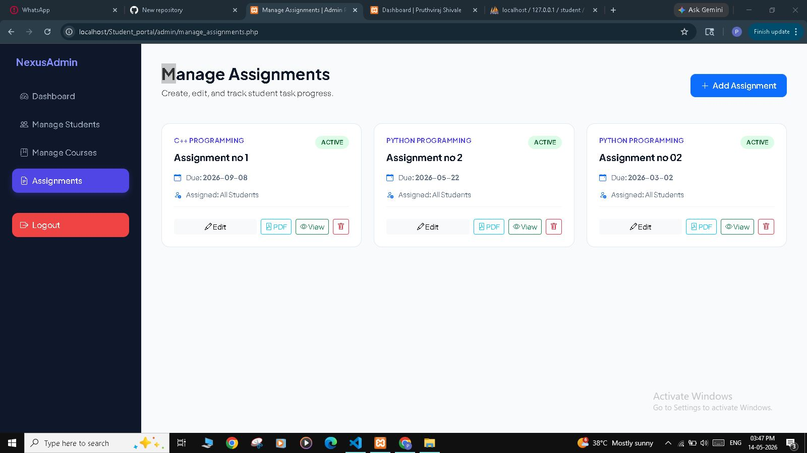

### Assignment Submission
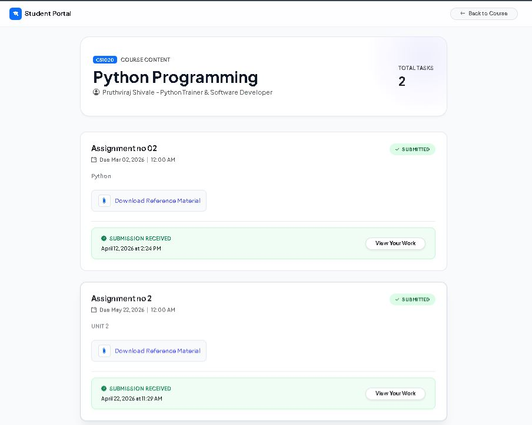

### View Submissions
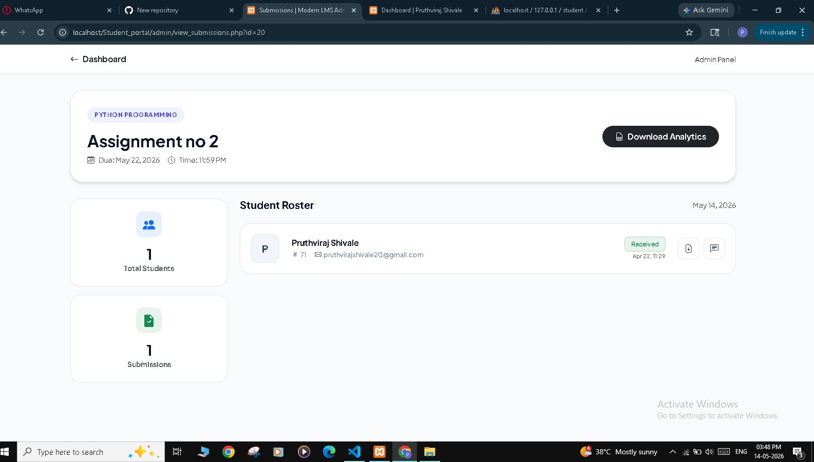

### Course Registration
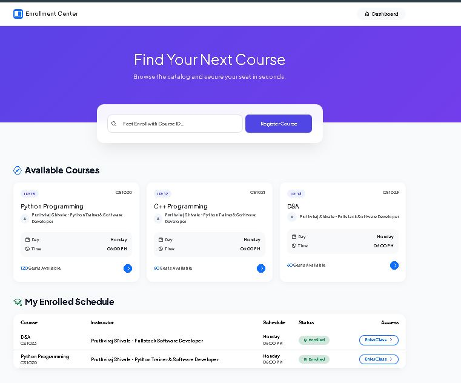

### Admin Notifications
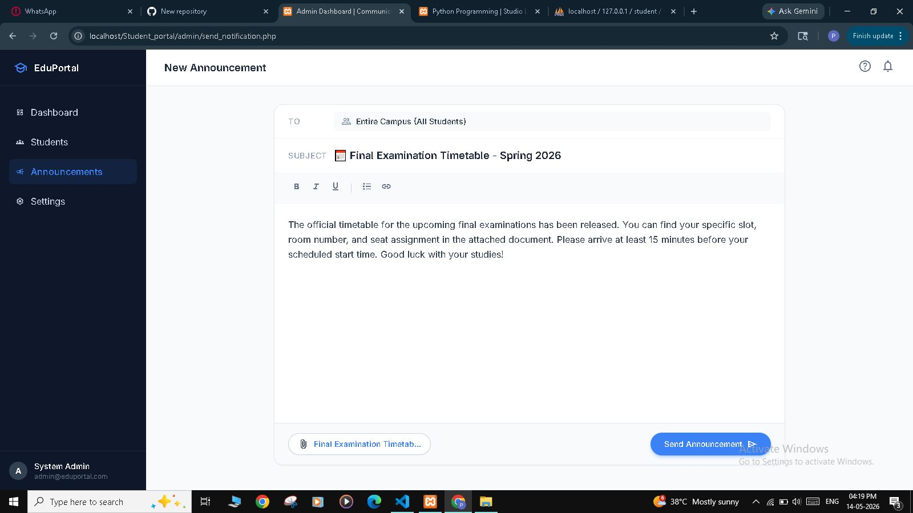

### Student Vault
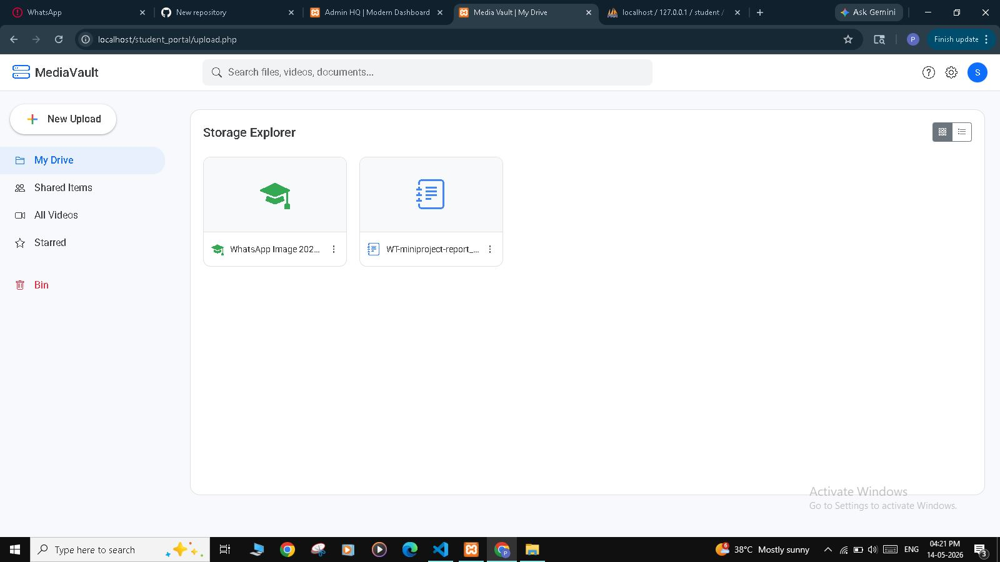

### Student Workspace
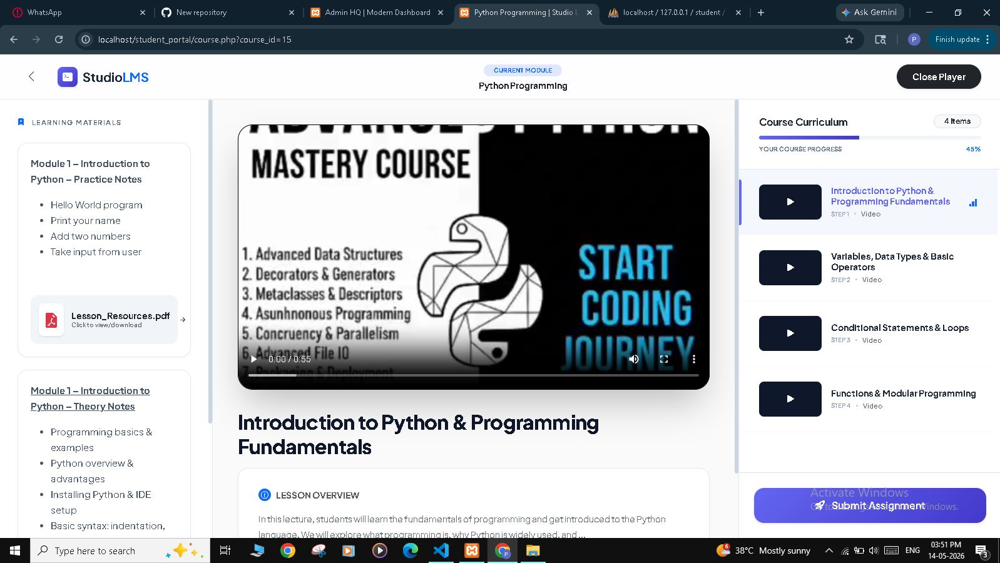

---

## ⚙️ Installation Steps

1. Download or Clone the project
2. Move project folder to `htdocs` (XAMPP)
3. Start Apache & MySQL in XAMPP
4. Import `student.sql` into phpMyAdmin
5. Run project in browser: http://localhost/student_portal

---

## 🎯 Project Type
Academic Major/Mini Project

---

## 👨‍💻 Developer
Pruthviraj Shivale

---

## 📌 Note
This project demonstrates a Learning Management System (LMS) with admin and student functionality, including course management, assignments, notifications, and personal workspace.


